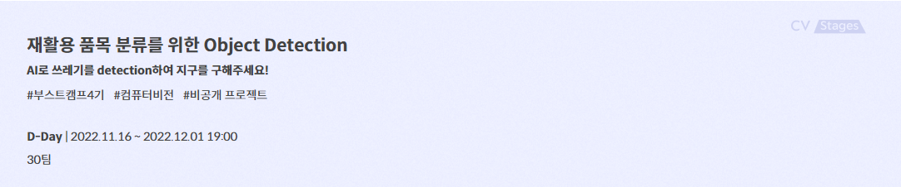
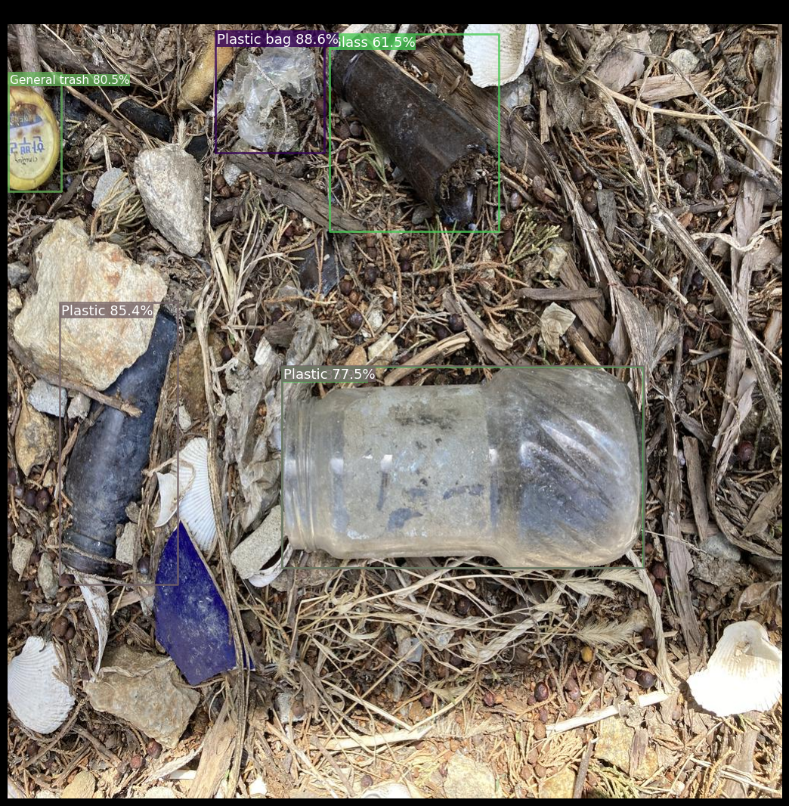
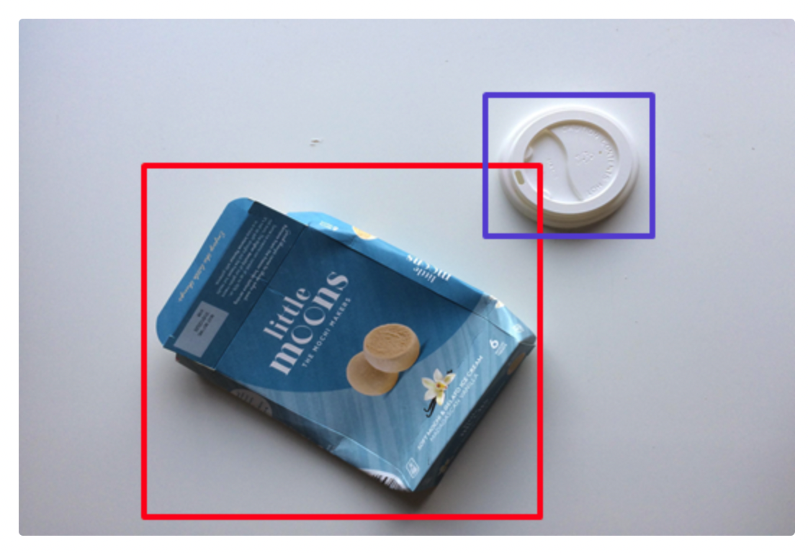
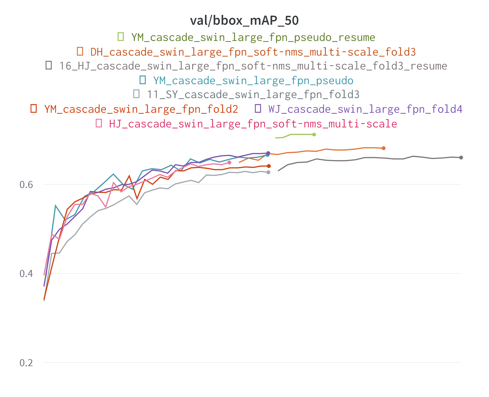
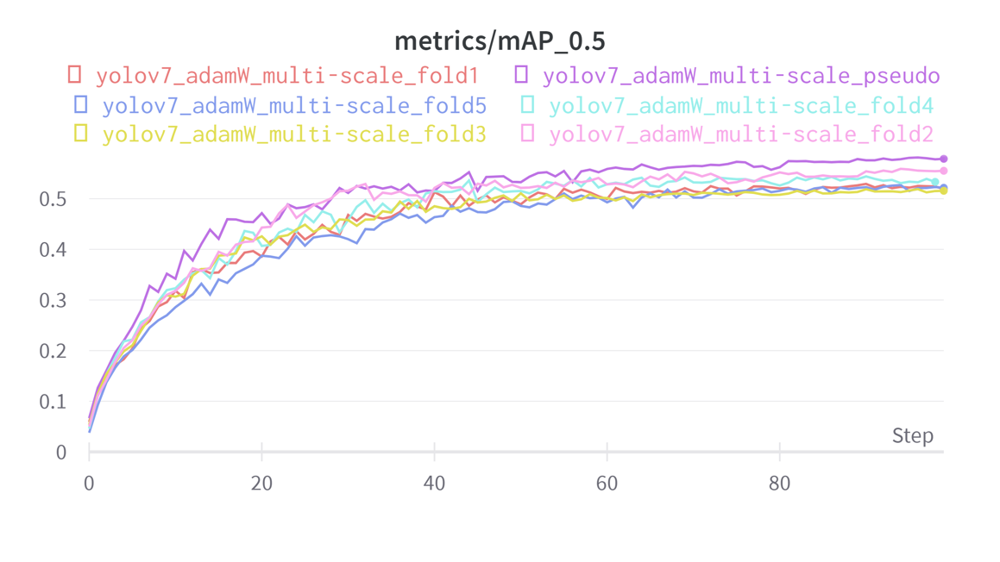

# 📃프로젝트 개요

분리수거는 증가하는 쓰레기양을 줄여 환경 부담을 줄일 수 있는 방법 중 하나입니다. 사진에서 쓰레기를 Detection 하는 모델을 만들어 분리수거를 더 쉽게 도와주어 쓰레기 문제를 해결하고자 합니다.

# 💾데이터셋

- 전체 이미지 개수 : 9754장 (Training : 4883장, Test : 4871장)
- 10 class : General trash, Paper, Paper pack, Metal, Glass, Plastic, Styrofoam, Plastic bag, Battery, Clothing
- 이미지 크기 : (1024, 1024)
- Annotation File (COCO format) : 이미지 내 객체의 위치 및 클래스 정보

# ✏ 프로젝트 수행 방법

## Data Processing

- MisLabeled
- Mosaic
- StratifiedGroupKFold
- Heavy Augmentation

## Modeling

### 2-Stage
- Model
    - Cascade RCNN
    - Cascade Mask RCNN
    - ATSS
- Backbone
  - Swin Transformer - tiny, Small, Base, Large
  - ConvNext - Small

- Neck
  - FPN, BiFPN, NasFPN 

### 1-Stage

- YoLo
- EfficientDet

### Optimizer & Scheduler

- Adam, AdamW
- Cosine Annealing

## Training

- Pseudo Labeling
- Ensemble

# 🏆 프로젝트 결과

- 2-Stage Ensemble

  

- 1-Stage Ensemble

  

  

- Score

  

# 👨‍👨‍👦‍👦 팀원 소개

|         [황순영](https://github.com/soonyoung-hwang)         |            [박용민](https://github.com/yon-ninii)            |            [서원준](https://github.com/won-joon)             |              [이하정](https://github.com/SS-hj)              |             [김도훈](https://github.com/DHKim95)             |
| :----------------------------------------------------------: | :----------------------------------------------------------: | :----------------------------------------------------------: | :----------------------------------------------------------: | :----------------------------------------------------------: |
|  |  |  |  |  |

